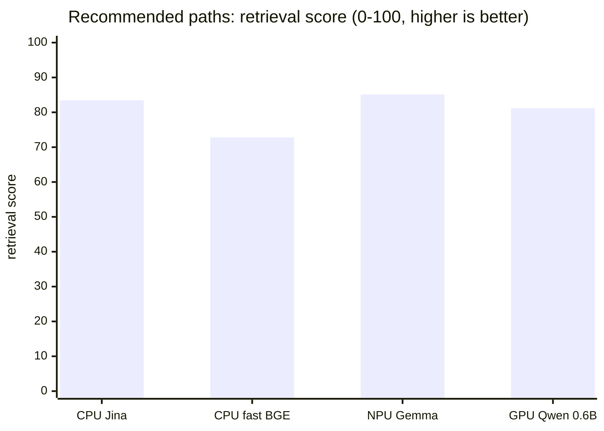
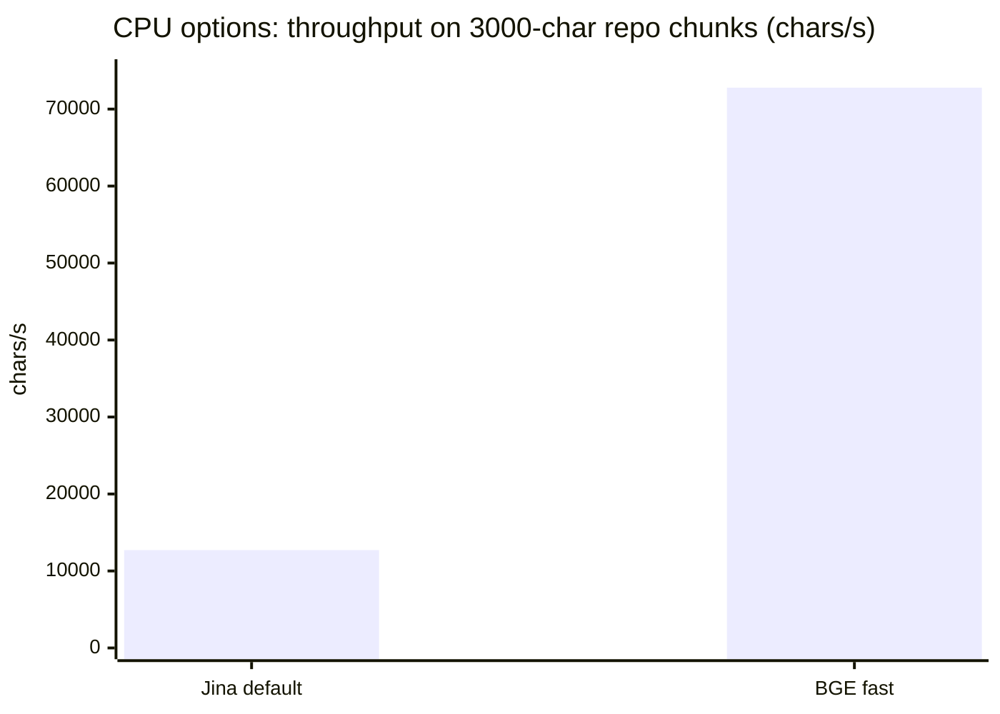
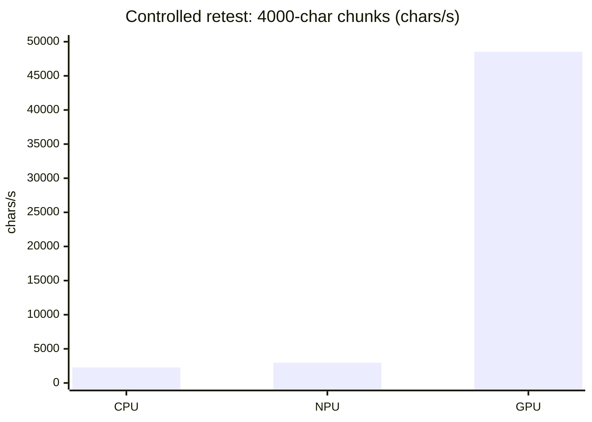

# Local Embedding Benchmarks

These results are a local snapshot from one development machine. They are
intended to explain the defaults used by `project-code-intelligence`, not to
make vendor-neutral hardware claims.

The benchmark story is split in two:

- Recommended model paths: the models this project now recommends for normal
  users.
- Controlled hardware retest: a fairer CPU/NPU/GPU power and throughput run
  using a shared EmbeddingGemma setup where possible.

## Recommended Defaults

| Path | Recommended model | Runtime | Why this path exists |
| --- | --- | --- | --- |
| CPU default | `jinaai/jina-embeddings-v2-base-code` | FastEmbed | Best CPU quality tradeoff in the local retrieval test. |
| CPU fast option | `BAAI/bge-small-en-v1.5` | FastEmbed | Much faster CPU indexing when lower retrieval quality is acceptable. |
| AMD NPU default | `embed-gemma-300m-FLM` | Lemonade FLM | EmbeddingGemma was the only NPU embedding model available at testing time. |
| GPU default | `Qwen3-Embedding-0.6B-Q8_0.gguf` | llama.cpp | Strong local quality without the cost and size of larger GPU candidates. |

The larger `Qwen3-Embedding-4B-Q8_0.gguf` candidate was tested, but it did not
meaningfully improve this repository's small retrieval evaluation, so it is not
the default.

## Which Option Should I Pick?

Run `pci-doctor` first. It checks the machine and prints the startup commands
for the profiles that are actually available.

| Situation | Pick | Why |
| --- | --- | --- |
| You want the safest local default | CPU default, `jinaai/jina-embeddings-v2-base-code` | Works on ordinary developer machines and nearly matched the NPU quality result in this local evaluation. |
| You have a supported AMD NPU | NPU default, `embed-gemma-300m-FLM` | Highest measured retrieval score here with much lower whole-system power than CPU in the hardware retest. |
| You have a supported AMD or NVIDIA GPU | GPU default, `Qwen3-Embedding-0.6B-Q8_0.gguf` | Best quality/performance tradeoff: competitive retrieval score and the strongest throughput/energy result in the hardware retest. |
| You need a quick CPU demo or first pass | CPU fast option, `BAAI/bge-small-en-v1.5` | Much faster CPU indexing, with lower retrieval quality. |
| You do not want local model runtime | OpenAI-compatible hosted endpoint | Keeps local setup simple, but sends embedding text to the configured provider. |

## Default-Model Quality

Quality was measured with a small in-repository retrieval evaluation:

- Corpus: public files from this repository
- Queries: 12 hand-written project-navigation queries
- Chunking: line-window chunks suitable for code indexing
- Scoring: normalized vectors with dot-product ranking

| Path | Model | Recall@1 | Recall@5 | Recall@10 | MRR | nDCG@10 |
| --- | --- | ---: | ---: | ---: | ---: | ---: |
| CPU default | `jinaai/jina-embeddings-v2-base-code` | 0.667 | 0.917 | 1.000 | 0.792 | 0.834 |
| CPU fast option | `BAAI/bge-small-en-v1.5` | 0.500 | 0.917 | 0.917 | 0.670 | 0.728 |
| AMD NPU default | `embed-gemma-300m-FLM` | 0.750 | 0.917 | 1.000 | 0.847 | 0.851 |
| GPU default | `Qwen3-Embedding-0.6B-Q8_0.gguf` | 0.667 | 1.000 | 1.000 | 0.794 | 0.812 |
| GPU 4B candidate | `Qwen3-Embedding-4B-Q8_0.gguf` | 0.500 | 0.917 | 1.000 | 0.694 | 0.783 |

This quality test is intentionally small. It is useful for deciding which
defaults fit this project, but it should not be read as a general embedding
leaderboard.

The practical read is that the AMD NPU default had the highest retrieval quality
in this evaluation. The CPU default was close on quality, but the controlled
hardware retest below shows that CPU indexing had a much higher whole-system
power cost on this machine. The GPU default had competitive quality, and the
hardware retest shows GPU acceleration is the strongest throughput and
energy-per-character path when a supported GPU is available.

## CPU Default Vs Fast Option

The CPU comparison used FastEmbed on repository-derived chunks with a
3000-character ceiling, batch size 32, and at least 20 seconds of measured
runtime per row.

| CPU option | Vector dimensions | Chars/s | Texts/s | p50 latency | nDCG@10 |
| --- | ---: | ---: | ---: | ---: | ---: |
| `jinaai/jina-embeddings-v2-base-code` | 768 | 12,710 | 5.0 | 5.789s | 0.834 |
| `BAAI/bge-small-en-v1.5` | 384 | 72,782 | 28.1 | 1.081s | 0.728 |

The default favors retrieval quality. The fast option is useful for large
repositories, demos, and repeated local experiments where indexing speed matters
more than squeezing out the last bit of retrieval quality.

## Controlled Hardware Retest

The controlled retest answers a different question: how did CPU, NPU, and GPU
behave on this machine when chunk size, batch size, runtime, and wall-power
measurement were controlled?

This table should not be confused with the recommended model table above. CPU
and GPU used the same `embeddinggemma-300M-Q8_0.gguf` file through llama.cpp.
NPU used Lemonade's `embed-gemma-300m-FLM` package because that is the available
AMD NPU path. The comparison is useful for power and throughput behavior, but it
is not a pure model-quality comparison.

Each row is the median of three repeats. Rows ran for at least 60 seconds,
used batch size 16, and were measured with whole-system wall power from a
Tasmota smart plug.

| Input | Runtime | Input p50/p95 chars | Measured seconds | Chars/s | p50 latency | Wall W | Incremental W | Incremental J/kchar |
| --- | --- | ---: | ---: | ---: | ---: | ---: | ---: | ---: |
| 600 chars | CPU llama.cpp Q8 | 566 / 593 | 61.7 | 2,719 | 3.161s | 153.9 | 117.3 | 43.1 |
| 600 chars | NPU Lemonade FLM | 566 / 593 | 65.8 | 1,203 | 7.386s | 51.7 | 15.3 | 12.7 |
| 600 chars | GPU llama.cpp Q8 | 566 / 593 | 60.0 | 88,528 | 0.095s | 147.1 | 109.9 | 1.2 |
| 2000 chars | CPU llama.cpp Q8 | 1960 / 1992 | 67.5 | 2,442 | 11.163s | 154.0 | 117.1 | 48.0 |
| 2000 chars | NPU Lemonade FLM | 1960 / 1992 | 62.2 | 2,190 | 12.530s | 53.1 | 16.2 | 7.4 |
| 2000 chars | GPU llama.cpp Q8 | 1960 / 1992 | 60.2 | 68,589 | 0.411s | 153.7 | 113.5 | 1.6 |
| 4000 chars | CPU llama.cpp Q8 | 3952 / 3993 | 80.3 | 2,274 | 20.013s | 153.7 | 117.2 | 51.5 |
| 4000 chars | NPU Lemonade FLM | 3952 / 3993 | 61.3 | 2,978 | 15.290s | 58.4 | 21.3 | 7.2 |
| 4000 chars | GPU llama.cpp Q8 | 3952 / 3993 | 60.8 | 48,518 | 1.041s | 148.6 | 112.4 | 2.3 |

The NPU completed an additional 8000-character stress row at 3828 chars/s,
59.8 W wall power, and 6.2 incremental J/kchar. That row is not included in the
cross-backend comparison because the llama.cpp EmbeddingGemma path rejected one
repository chunk at 2312 tokenizer-reported tokens with `n_ctx=2048`.

## Test Machine

Date: 2026-05-11

Host:

- System: Framework Desktop (AMD Ryzen AI Max 300 Series), product version A6
- CPU/APU: AMD RYZEN AI MAX+ 395 w/ Radeon 8060S
- CPU topology: 16 cores, 32 threads
- Memory: 125 GiB
- GPU: AMD Strix Halo / Radeon 8060S Graphics, PCI ID `1002:1586`
- NPU: AMD Strix/Krackan/Strix Halo Neural Processing Unit, PCI ID `1022:17f0`
- NPU runtime validation: `/dev/accel/accel0`, 8 columns, firmware `1.1.2.65`,
  `amdxdna` version `0.6`
- OS: Debian GNU/Linux 13.4 (trixie)
- Kernel: `7.0.4+deb13-amd64`
- Docker Compose: `v5.1.3`

Power measurement:

- Wall power: local Tasmota smart plug queried with the `STATUS 8` command
- Tasmota firmware: `15.3.0(release-tasmota)`
- Reported field: `StatusSNS.ENERGY.Power`
- Sampling interval: 0.5 seconds
- Incremental wall power: run average minus pre-run idle average

## Interpretation

CPU is the compatibility path. The Jina FastEmbed default nearly matched the NPU
default's retrieval quality in this local evaluation, while BGE-small is the fast
CPU option. The tradeoff is power: in the controlled hardware retest, CPU
indexing cost much more whole-system power than the NPU path.

NPU is the quality and low-wall-power path on this AMD machine. It had the
highest nDCG@10 score among the recommended defaults and kept whole-system power
much closer to idle than CPU or GPU during the controlled retest.

GPU is the best quality/performance path when available. The Qwen3 0.6B default
was competitive in the quality evaluation, and in the controlled hardware retest
GPU acceleration completed the workload far faster and had the lowest
incremental energy per source character.

The practical default sequence is therefore:

1. Use FastEmbed CPU by default so the project works on ordinary developer
   machines.
2. Use hosted OpenAI-compatible embedding providers when local runtime setup is
   not worth the operational cost.
3. Use the AMD NPU profile when low local wall power matters and the hardware is
   supported.
4. Use the GPU profile when indexing time matters most.

## Caveats

- Tasmota wall power measures the whole desktop, not the accelerator alone.
- Incremental power depends on the pre-run idle baseline. Background services,
  display state, cooling behavior, and desktop activity can move the baseline.
- Tasmota power updates are coarse compared with in-process benchmark timing,
  so hardware rows were run for at least 60 seconds and reported as medians of
  three repeats.
- The retrieval quality evaluation is intentionally small and project-specific. It
  is useful for project defaults, not for ranking embedding models globally.
- The 8000-character llama.cpp failure is a model/runtime context-limit result,
  not a CPU hardware failure.

## References

- AMD Ryzen AI Max+ 395 official specifications:
  https://www.amd.com/en/products/processors/laptop/ryzen/ai-300-series/amd-ryzen-ai-max-plus-395.html
- EmbeddingGemma model overview:
  https://ai.google.dev/gemma/docs/embeddinggemma
- AMD Lemonade playbook:
  https://developer.amd.com/playbooks/lemonade-getting-started/
- Lemonade SDK repository:
  https://github.com/lemonade-sdk/lemonade
- Mermaid XY chart syntax:
  https://mermaid.js.org/syntax/xyChart.html
